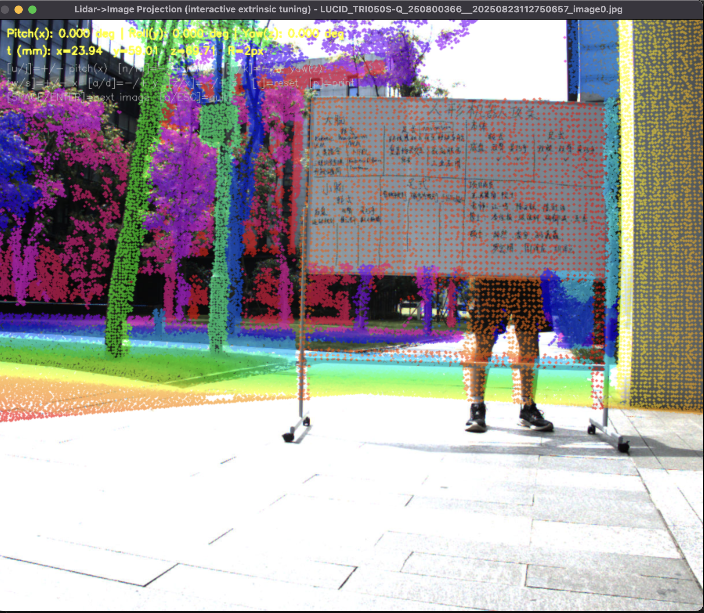
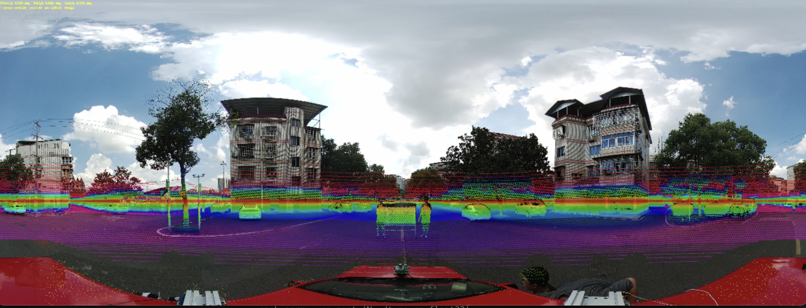
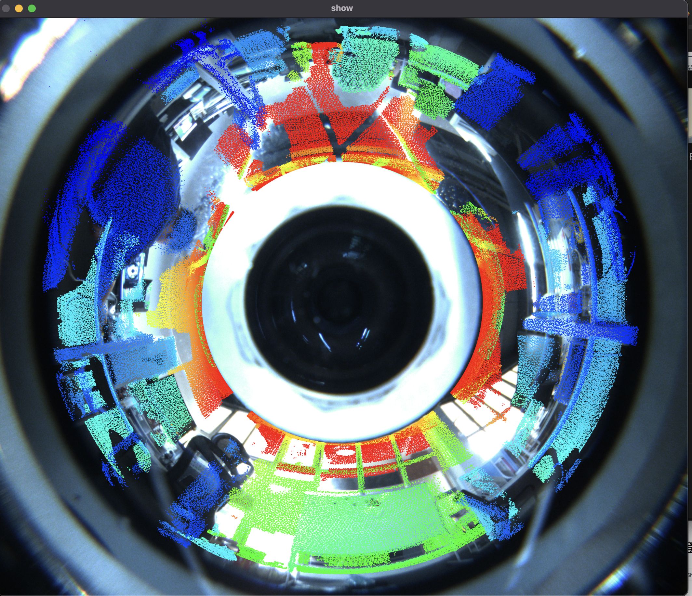

[English Readme](./Readme_en.md)

# 雷达-相机外参标定流程

本项目用于相机与激光雷达的外参标定，支持针孔/鱼眼相机、等矩形投影图（ERP）、以及全景环带相机（PAL）。标定流程以“手工标注四个角点”为核心，结合优化与可视化完成外参求解。

**数据准备（必读）**
`example/` 文件夹存放示例图片与点云文件，请先从 [Google Drive 链接](https://drive.google.com/file/d/1UM3ZfcYInfgu6ADCPa5w8MAr3hAx7B-p/view?usp=sharing) 下载 zip 并解压后放入该目录，否则示例无法运行。

## 目录

- [支持的相机类型](#支持的相机类型)
- [环境与依赖](#环境与依赖)
- [目录结构](#目录结构)
- [快速开始](#快速开始)
- [配置文件说明](#配置文件说明)
- [针孔-鱼眼-ERP 标定流程](#针孔-鱼眼-ERP-标定流程)
- [环带相机 PAL 标定流程](#环带相机-pal-标定流程)
- [输出结果](#输出结果)
- [常见问题](#常见问题)

## 支持的相机类型

- 针孔/鱼眼相机

  

- 多鱼眼拼接的全景相机（ERP）

  

- 全景环带相机（ERP 展开图 / 原始 PAL）

  

  

## 环境与依赖

- Python 3.10 或更高版本
- 依赖包：`open3d`, `numpy`, `opencv-python`, `scipy`, `pyyaml`

```bash
pip install open3d numpy opencv-python scipy pyyaml
```

## 目录结构

- `config/`: 配置文件
- `example/`: 示例数据
- `sign/`: 标注点与内参示例
- `result/`: 外参和优化后的内参输出
- `label_image_corners.py`: 图像标注工具
- `label_lidar_corners.py`: 点云标注工具
- `lidar_image_overlay.py`: 针孔/鱼眼/ERP 标定与可视化
- `extrinsics_PAL.cpp`: PAL 相机标定与可视化

## 快速开始

1. 浅克隆仓库（不拉取历史，减少数据量）：

```bash
git clone --depth 1 https://github.com/losehu/CameraLiDAR-Calib.git
```

2. 选择数据集配置：编辑 `config/config.yaml`，指向你的配置文件。
2. 标注图像角点：运行 `label_image_corners.py`。
3. 标注雷达角点：运行 `label_lidar_corners.py`。
4. 运行标定与可视化（不同相机类型对应不同脚本）。

## 配置文件说明

`config/config.yaml` 只用于重定向实际数据配置文件：

```yaml
config_path: config/911.yaml
```

数据集配置示例（针孔/鱼眼/ERP）：

```yaml
# 标注好的雷达点路径, txt
lidar_out: "./sign/lidar_point_hongwai.txt"
# 标注好的图片点路径, txt
photo_out: "./sign/photo_point_hongwai.txt"
# 雷达 pcd 文件夹路径
lidar_dir: "./example/hongwai/lidar"
# 图片文件夹路径
image_dir: "./example/hongwai/photo"
# 外参保存路径, txt
extrinsic_out: "./result/extrinsic_hongwai.txt"
# 内参路径, txt, 等矩形投影图不需要填
intrinsics_path: "./sign/int_hongwai.txt"
# 投影模型, 等矩形投影图不需要填
projection_model: "pinhole"
# 图片宽高
image_width: 640
image_height: 512
```

说明：
- `lidar_out` / `photo_out` / `extrinsic_out` 为输出路径，可自定义。
- `lidar_dir` / `image_dir` / `intrinsics_path` / `image_width` / `image_height` 请根据数据实际情况填写。
- 内参格式参考：`sign/int_hongwai.txt` 与 `sign/int_pianzhen.txt`。

## 针孔-鱼眼-ERP 标定流程

1. 修改 `config/config.yaml`，指向对应的数据配置文件。
   - `config/911.yaml` / `config/913.yaml` / `config/923.yaml` 为 ERP 示例配置。
   - `config/hongwai.yaml` / `config/pianzhen.yaml` 为针孔/鱼眼示例配置。
2. 标注图像角点：

```bash
python label_image_corners.py
```

使用鼠标左键在图像中点击四个角点（例如标定板角点）。

3. 标注雷达角点：

```bash
python label_lidar_corners.py
```

使用 Shift + 鼠标左键在点云中点击四个角点。

4. 运行标定与可视化：

```bash
python lidar_image_overlay.py
```

## 环带相机 PAL 标定流程

1. 使用 [PanoRing-Calib](https://github.com/losehu/PanoRing-Calib) 先获得环带相机初始内参，示例见 `sign/int_huandai.txt`。
2. 填写 PAL 配置文件，参考 `config/huandai.yaml`：

```yaml
# 标注好的雷达点路径
lidar_out: "./sign/lidar_point_huandai.txt"
# 标注好的图片点路径
photo_out: "./sign/photo_point_huandai.txt"
# 雷达 pcd 文件夹路径
lidar_dir: "./example/huandai/lidar"
# 图片文件夹路径
image_dir: "./example/huandai/photo"
# 展开图文件夹路径
erp_image_dir: "./example/huandai/new_unfold"
# 外参保存路径
extrinsic_out: "./result/extrinsic_huandai.txt"
# 内参路径
intrinsics_path: "./sign/int_huandai.txt"
# 优化后内参保存路径
intrinsics_better: "./result/ocam_refined_huandai.txt"
```

3. 标注图像与雷达角点（同上）：

```bash
python label_image_corners.py
python label_lidar_corners.py
```

4. 安装 `CMakeLists.txt` 中提示的 C++ 依赖，编译并运行 `extrinsics_PAL.cpp` 完成标定与可视化。

5. 标定完成后会输出 `flip` 情况，请在后续 Python 脚本中同步修改 `flip` 参数（如 `PAL2ERP.py`、`lidar_PAL_ERP_overlay.py`、`lidar_PAL_overlay.py`）。

6. 标定完成后：

- 展开 PAL 图到 ERP：

```bash
python PAL2ERP.py
```

- 将雷达点投影到展开 ERP：

```bash
python lidar_PAL_ERP_overlay.py
```

- 将雷达点投影到 PAL 原图：

```bash
python lidar_PAL_overlay.py
```

## 输出结果

- 外参：`result/` 下的 `extrinsic_*.txt`
- PAL 优化后的内参：`result/ocam_refined_*.txt`
- 标注点：`sign/` 下的 `lidar_point_*.txt` 与 `photo_point_*.txt`

## 常见问题

- 标注文件会被覆盖：每次标注会覆盖旧文件，请提前备份。
- 点顺序必须一致：图像与点云的四点顺序需一一对应，否则优化失败或误差很大。
- 路径含中文或空格时，建议使用绝对路径，避免读取失败。
